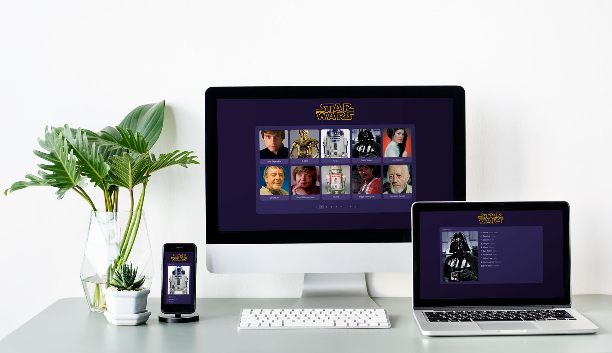

<h3 align="center">
  Star Wars Character Database
</h3>

  

## :computer: Project

Star Wars Character Database is a small Next.js project to give a fast and friendly interface to the [SWAPI Api](https://swapi.dev/).

## :rocket: Technologies

This project was developed with the following technologies:

- [React](https://reactjs.org)
- [Next.js](https://nextjs.org/)

---

Made with ♥ by Victor Alvarenga :wave: [Get in touch!](https://www.linkedin.com/in/victoralvarenga/)
